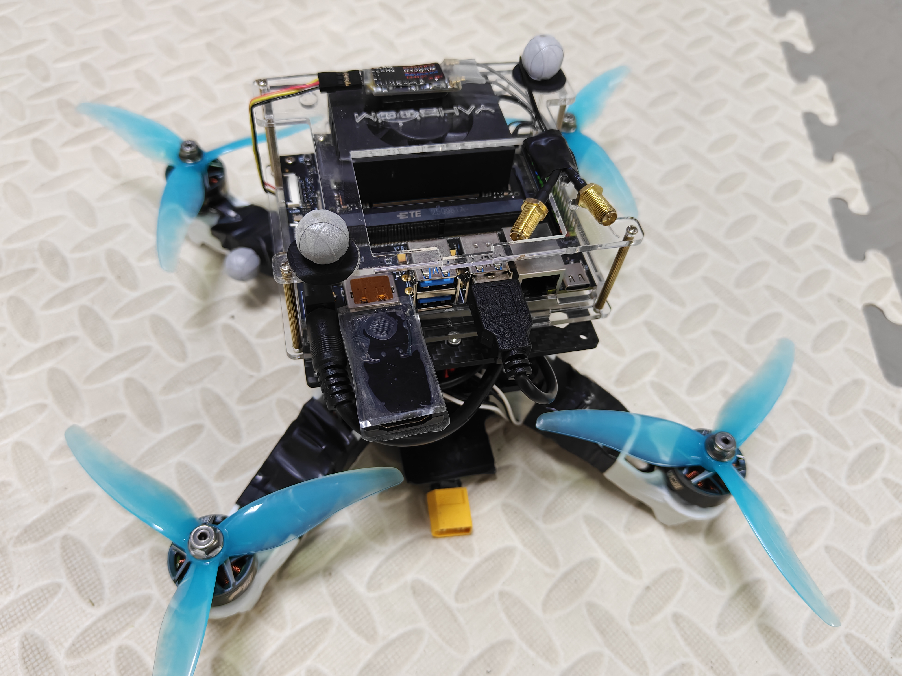
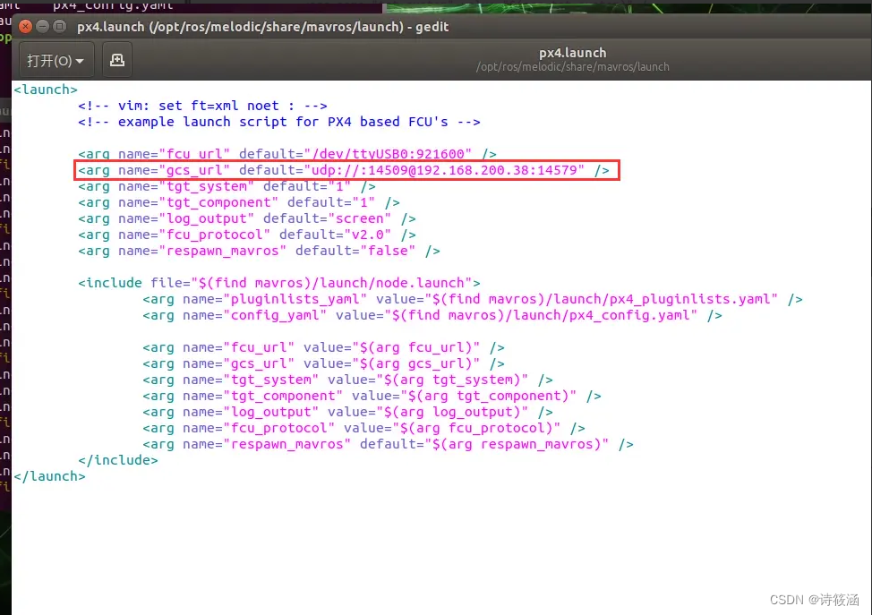
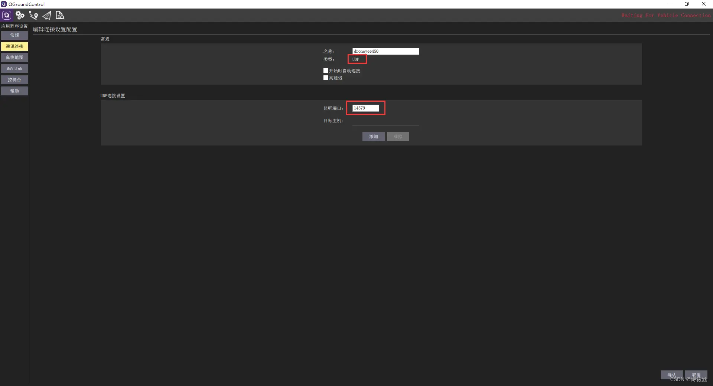

# 组装一个无人机学习记录
## 硬件组装
- 参考 [高飞 FAST-LAB 无人机组装教学](https://github.com/ZJU-FAST-Lab/Fast-Drone-250)
  - 机载电脑替换成Nividia TX super
  - 飞控使用的是 PX4 6C mini
  - 电调可以使用四合一电调节省空间
  - 注意接收机和遥控器对应，尽量使用统一厂家的，不然可能连不上(乐迪或者天地飞)
    

- 其余参考硬件组装
  1.  [香港科技大学空中机器人实验室](https://github.com/HKUST-Aerial-Robotics/UniQuad)
  2.  [天津大学控制机器人实验室YOPO](https://github.com/TJU-Aerial-Robotics/YOPO)
  3.  [云纵科技](https://github.com/YunDrone-Team/Sunray)
  4.  [微空科技](https://micoair.cn/docs/wei-kong-MVD30-3-cun-quan-quan-ji-jia)

- 组装时可能遇到的问题
  1.  注意电机如果不支持DShot协议要注意电机转向是否正确
  2.  注意飞控方向的安装，在QGC中可以设置

## 机载电脑常用和调试软件安装
- **Vscode**
- **Terminator**: `sudo apt install terminator`
- **Plotjuggler**(注意自己ROS版本):
  - `sudo apt install ros-noetic-plotjuggler`
  - `sudo apt install ros-noetic-plotjuggler-ros`
  - `rosrun plotjuggler plotjuggler`
- 查看电脑ip工具 **Net-tools**:
  - `sudo apt install net-tools`
  - `ifcongig`
- 终端远程连接 **ssh**：
  - `sudo apt install openssh-server`
  - 两个电脑连在同一个局域网下，使用命令 `ping 192.168.**.**` 测试是否连接成功
  - 如成功可以设置别名，用命令 `sudo gedit /etc/hosts` 打开文件，加入 `192.168.**.** zr_laptop`
  - 使用命令 `ping zr_laptop` 测试是否连接成功
  - `ssh zr@zr_laptop (ssh 用户名@别名)` 输入密码后终端远程连接成功
- **NoMachine** 远程桌面连接软件(在同一个局域网下)
- Vscode 插件 **Remote SSH** 可以在 Vscode 中直接编辑代码
- 终端编辑软件 **Vim** `sudo apt install vim`

## ROS1 使用 MAVROS 与 PX4 通讯启用 offboard 飞行
- 飞控相关文件下载及配置，参考[PX4官网教程](https://docs.px4.io/main/en/ros/ros1)
  - 安装 PX4 固件 (如果不使用仿真或者二次开发可以不需要安装，直接从QGC烧录固件到PX4)
    - 下载 PX4 源代码：`git clone https://github.com/PX4/PX4-Autopilot.git --recursive`
    - 安装相关依赖：`bash ./PX4-Autopilot/Tools/setup/ubuntu.sh`
  - 安装 MAVROS (注意 ROS 版本)：
    - `sudo apt-get install ros-${ROS_DISTRO}-mavros`
    - `ros-${ROS_DISTRO}-mavros-extras`
    - `ros-${ROS_DISTRO}-mavros-msgs`
  - 安装 GeographicLib 数据集：
    - `wget https://raw.githubusercontent.com/mavlink/mavros/master/mavros/scripts/install_geographiclib_datasets.sh`
    - `sudo bash ./install_geographiclib_datasets.sh`
  - 地面站 QGC 的安装：
    - [根据自己 ubuntu 版本安装对应的 QGC 版本](https://github.com/mavlink/qgroundcontrol/releases)（注意 ubuntu 20.04 最高支持 QGC v4.4.4 版本）
    - 在同一个局域网下不需要机载电脑安装 QGC，因为机载电脑如果是 arm 架构安装 QGC 十分不方便，可以通过 MAVROS 经过 WIFI 连接 PX4，[参考帖子](https://blog.csdn.net/sinat_16643223/article/details/136336316)
      - 打开 MAVROS launch 文件：`sudo gedit /opt/ros/${ROS_DISTRO}/share/mavros/launch/px4.launch`
      - 修改 `gcs_url` 对应行，填入笔记本电脑 ip，比如 `udp://:14509@笔记本ip:14579` 
      - QGC 连接时选择 UDP ，填入对应端口号 `14579` 
      - 也可将 `gcs_url` 改为 `udp-b://@`，这样 QGC 会自动连接飞控，但是 PX4 可能会报延迟的错误，不推荐
  - PX4 与机载电脑连接：
    - 将上述 `launch` 文件中的 `fcu_url` 改为 `/dev/ttyACM0:57600`(其中，`ttyACM*`标识一般是飞控的原生USB口，而`ttyUSB*`一般是TELEM1/2或者Debug端口，需转接线。后面的`57600`表示波特率)，注意启动 launch 文件时一般需要赋予权限 `sudo chmod 777 /dev/ttyACM01`
    - 如果使用 PX4 自带的仿真则将 `fcu_url` 改为 `udp://:14540@127.0.0.1:14557`

- 标定 Optitrack 动捕系统，[参考帖子](https://gitee.com/zzy19960123/ARTech_Seashells/blob/master/vrpn_motive.md)，[PX4官网](https://docs.px4.io/main/en/ros/external_position_estimation)和[教学视频](https://www.youtube.com/watch?v=cNZaFEghTBU)
  - 注意每个动捕系统在局域网中的 ip 可能不同，请根据实际情况进行更改
  - 注意设置 Z 轴向上，因为 optitrack 默认 Y 轴朝上
  - 注意设置 VRPN 的端口，默认为 3883

- [PX4 通过 VRPN 获取动捕系统获得无人机位姿](https://docs.px4.io/main/en/ros/external_position_estimation)
  - 安装 `vrpn_client_ros`: 
  ```
  sudo apt install ros-${ROS_DISTRO}$-vrpn-client-ros -y
  ```
  - 也可以 `git clone` 本地编译:
  ```
  sudo apt install ros-melodic-vrpn -y
  git clone https://github.com/ros-drivers/vrpn_client_ros.git
  ```
  - 修改 `sample.launch` 文件，`localhost` 对应动捕系统 ip，`port` 对应VRPN 端口
  ```
  - <arg name="server" default="localhost"/>
  + <arg name="server" default="192.168.5.4"/>
  ```
  - 在 `launch` 文件中加入一段代码，让 VRPN 获取的无人机位姿重映射到 MAVROS 中，注意 `rigid_body` 参数即在动捕中设置的刚体的名称
  ```
  <remap from="/vrpn_client_node/$(arg rigid_body)/pose" to="/mavros/vision_pose/pose"/>
  ```
  - 注意 ROS 和 PX4 使用的局部/世界和世界坐标系是不同的，PX4 中使用的是 **FRD(X Forward, Y Right, Z Down)**，而 ROS 中使用的是 **FLU (X Forward, Y Left, Z Up), `base_link`(机体坐标系)，ENU (X East, Y North, Z Up)`odom` 或 `map`(世界坐标系)**，但是 ROS 使用 ENU 坐标系作为惯例，因此位置反馈必须以 ENU 格式提供。如果是 Optitrack 系统，可以使用 mocap_optitrack 节点，该节点会将物体姿态以 ENU 格式流式传输到 ROS 主题上。通过重映射，可以直接将其发布到 `mocap_pose_estimate` 上，无需任何转换，MAVROS 会负责 NED 转换
  - 其他约定不同的坐标系请参考[PX4官网](https://docs.px4.io/main/en/ros/external_position_estimation)进行坐标系变换
  - 注意调整 PX4 的 **EKF2** 位姿定位数据融合相关参数，参考上述官网

- 编写一个程序实现无人机 offboard 飞行
  - 在此之前先实现无人机遥控器的 position 飞行模式可以正常解锁并可以稳定悬停
  - `offboard_circle.cpp` 利用 PX4 定点飞行实现无人机绕圆三周并自动降落上锁的过程，启动顺序：
    - 远程终端进入机载电脑：`ssh zr@zr_laptop`
    - 赋予飞控串口权限并启动 MAVROS：
        ```
        sudo chmod 777 /dev/ttyACM0
        roslaunch mavros px4.launch
        ````
    - 启动 VRPN 获取无人机位姿
        ```
        roslaunch vrpn_client_ros sample.launch
        ````
    - 输入`rostopic echo /mavros/local_postion/pose`，移动无人机观察输出位姿是否正确
    - 遥控打开 `kill` 开关，转到 `offboard` 模式，启动程序：
        ```
        rosrun offboard offboard_circle
        ````
    - 芜湖起飞！！！ 

# TODO 
1. 加入 Realsense D435i 相机利用 Vins-Mono 实现定位
2. 加入轨迹规划实现避障


